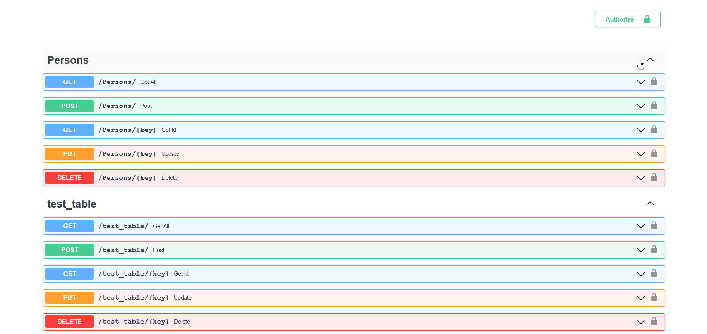

# Apifactory

Apifacotry allows you to create APIs on existing (currently only SQL) databases nearly automatically. It handles all sorts of setup automatically for you, including creating pydantic data schemas setting up login and JWT. 


Apifactory uses SQLAlchemy to automatically detect tables in the given database. If these tables have single column primary keys they are added to your API, multicolumn primary keys will be added in the future.

Apifactory uses fastapi to construct its APIs. This means the schemas you accept or return in your API are defined by pydantic, which also handles validation of input types and return types. These schemas are automatically generated from the SQLAlchemy table models that are generated by apifactory.

Apifactory automatically prevents unauthorized access. Users of your API need to log in and get a JWT to authenticate at the API endpoints Authorization is based on a user defined existing Users table.

## A short example how to set up an API

Apifactory will add all tables with a single column primary key. All columns of these table will be added to the schema of your API. However, this might not be preferred for all methods. For example, you might not want your post requests to also dictate the primary key the entry. This could for example be handled by the database itself. Currently, you can add some config to dictate which columns to exclude in post and put requests.In addition, you need to specify the database connection string. And specify the name of the table containing hashed passwords for user authentication.


```python
from apifactory.app_factory import ApiFactory

dburl = "<database url>"

key = "<key for jwt encryption>"
configs = {
    "Persons": {
        "excluded_columns_put": ["Personid", "createdDate"],
        "excluded_columns_post": ["Personid", "createdDate"],
    },
    "test_table": {"excluded_columns_put": ["primarykey"]},
}
usermodel_name = 'Users'

app = ApiFactory(dburl, usermodel_name, key, configs).app_factory()
```

You can serve the file 
```bash 
uvicorn <name of your file containg the app>:app 
```

Since apifactory uses fastapi you automatically can visit an openapi page containing the details of your API.




Apifactory is currently heavily under development and not feature complete/stable. 
Features to be included in the future:
* More configuration options
* Multicolumn primary key support
* Support for views 
* Add scopes to JWT
* Configure from files YAML/JSON
* Add support for custom classes inserted into ApiFactory* Make apifactory completely asynchronous
* docs
